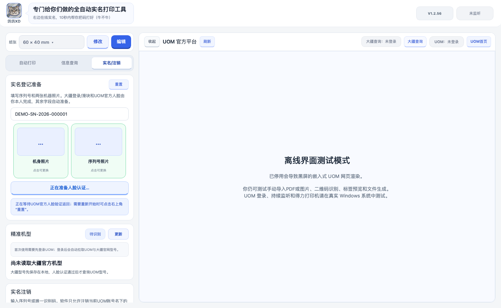

# UOM自动打印

把无人机实名登记、信息查询和标签打印放在一个 Windows 工作台里。支持监听 UOM 新增登记、导入实名码打印、自定义标签排版，以及按官方流程辅助实名登记和注销。

**当前正式版：v1.2.56 · Windows 10/11 x64 · MIT 开源**

[下载安装包](https://github.com/GGXD1122/uom-auto-printer/releases/latest) · [使用说明](docs/USER_GUIDE.md) · [开发与构建](docs/DEVELOPMENT.md) · [反馈问题](https://github.com/GGXD1122/uom-auto-printer/issues)

## 下载后就能用

在 Releases 下载 `UOM自动打印-Setup-v1.2.56.exe`，安装后从桌面启动。安装包已包含 Python 和界面运行环境，不需要另外安装 Python。

连接标签打印机并安装对应的 Windows 驱动，在软件中选择打印机、纸张和每种标签的张数，然后登录右侧 UOM 官网。首次使用建议先手动打印一组，核对方向和实际尺寸。

升级前从系统托盘选择“退出程序”，再运行新安装包。沿用原安装位置，打印设置、个人预设等仍保存在原来的用户数据目录。仅关闭主窗口可能仍在后台运行。

## 能做什么

| 功能 | 使用方式 |
| --- | --- |
| 自动打印 | 开启监听后只处理新增登记；首次建立基线，不批量补打历史设备 |
| 导入打印 | 导入或拖入实名 PDF、二维码图片，识别后重建清晰二维码 |
| 独立打印开关 | “新增登记自动打印”和“导入后自动打印”分别控制 |
| 信息查询 | 输入飞机序列号，或导入机身实名码；支持复制结果和打印 |
| 标签排版 | 标签 1/2 共用纸张尺寸；19 种常用预设，自定义宽高 10–200 mm |
| 个人预设 | 编辑元素位置、大小、旋转，保存命名预设后在纸张列表选择 |
| 实名辅助 | 提供序列号与两张照片，经过 DJI 查询、UOM 人脸验证后准备登记表单 |
| 型号选择 | 唯一可靠匹配自动采用；多个候选或无法确定时由用户核对选择 |
| 本地型号库 | 首次为空，登录后点击更新，获取 UOM 型号与 DJI 官方产品目录 |
| 本人设备注销 | 核验当前账号归属，确认后注销；不能注销其他账号的设备 |
| 悬浮窗 | 主窗口收起后可查看状态、接收文件；可从托盘控制和退出 |

查询只能显示官方实际返回的信息。公开序列号查询可能隐藏手机号；机身实名码详情与当前账号可访问的信息可能更完整。

## 工作原理

导入文件时，程序提取二维码内容并查询 UOM 登记详情，再按当前模板重建二维码、渲染两张标签。预览先放在应用缓存；点击打印或触发自动打印后，才将正式 PNG/PDF 保存到输出目录，并交给 Windows 打印队列。

监听通过本机浏览器会话读取当前账号可访问的记录，用 SQLite 保存基线和处理历史，避免首次开启或重启后重复打印。

实名辅助遵循官网步骤：DJI 查询结果先保存在本地，用户完成 UOM 官方人脸认证后，软件才准备登记信息和照片上传。最终提交仍有包含资料和照片的确认窗口。用户取消后可继续提交；遇到超时或中断，按界面提示重试、重置或核对登记结果，避免重复操作。

## 界面

下图来自 v1.2.56 的真实界面测试，展示实名准备区和重置入口。右侧“离线界面测试模式”是测试环境提示，正常 Windows 安装运行显示官网。



## 从源码运行

```powershell
git clone https://github.com/GGXD1122/uom-auto-printer.git
cd uom-auto-printer
py -3.11 -m venv .venv-win
.\.venv-win\Scripts\python.exe -m pip install -e ".[windows,test]"
.\.venv-win\Scripts\python.exe run.py
```

运行测试：

```powershell
.\.venv-win\Scripts\python.exe -m pytest -q
```

打包执行 `build_windows.bat`。详细环境和模块说明见[开发文档](docs/DEVELOPMENT.md)。

## 说明

- 本项目由鸽鸽XD开发维护，与 UOM、民航局和大疆不存在官方隶属关系。
- 官网登录、验证码、人脸认证需要用户本人完成；官网服务或接口变化可能影响相关功能。
- 源码使用 [MIT License](LICENSE)。PySide6、PyMuPDF 等依赖采用各自许可证，重新分发时请核对[第三方依赖说明](docs/DEPENDENCIES.md)。
- 登录会话、输出标签和日志保存在本机，不属于源码发布内容。提交问题时请勿上传账号凭据。
